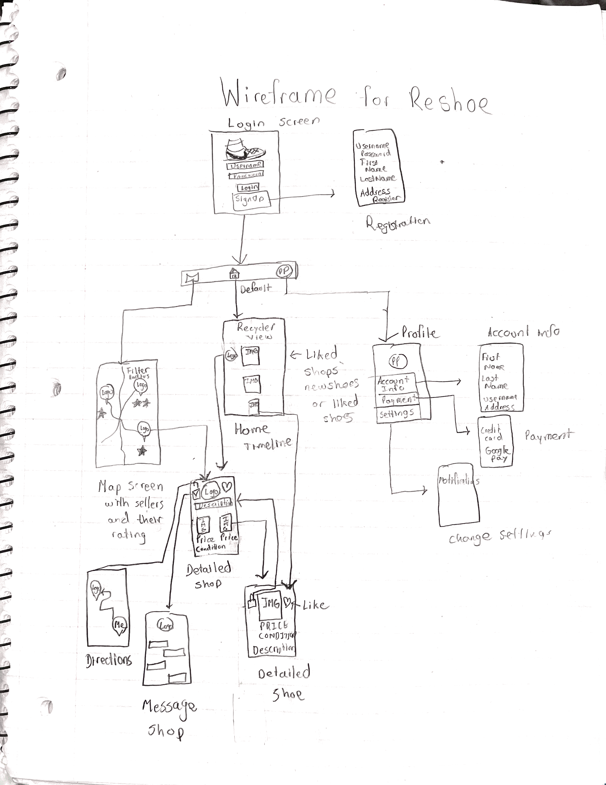

Original App Design Project - README Template
===

# Reshoe

## Table of Contents
1. [Overview](#Overview)
1. [Product Spec](#Product-Spec)
1. [Wireframes](#Wireframes)
2. [Schema](#Schema)

## Overview
### Description
An app that allows users to buy and sell new or used sneakers locally. This app allows local sneaker resell sellers to interact directly with customers on a streamlined app, while allowing buyers to find local sellers, instead of having to deal with long shipping times and hefty fees.

### App Evaluation
[Evaluation of your app across the following attributes]
- **Category:**
- **Mobile:**
- **Story:**
- **Market:**
- **Habit:**
- **Scope:**

## Product Spec

### 1. User Stories (Required and Optional)

**Required Must-have Stories**

* Users can view and post images about shoes (Sellers post and buyers view).
* Buyers can post ratings about shops.
* Users can login, choosing between a seller or buyer account. Sellers must say whether they do drop-off or have an actual storefront.
* Buyers and sellers must be able to communicate with one another.

**Optional Nice-to-have Stories**

* Buyers can get directions to the shoe store (if it exists) via Google Maps.
* Sellers can connect their other social media pages to the app.
* Clean and accessible UI design.
* Notifications remind users of new releases from a favorited shop.
* Users can create an account through linking external accounts: Google, Facebook, Snapchat, etc.

### 2. Screen Archetypes

* Login screen
   * Users can login
* Account registration screen
   * New users can create an account, choosing a buyer or a seller account.
* Search screen
   * Users can view local shops.
   * Sellers' ratings and location shown on the map screen.
* Detailed Seller Screen
   * Buyers can view the gallery of shoe images and reviews of the seller. Can favorite the seller to recieve notifications of new stock.
* Detailed Shoe Screen
    * Buyers can view the shoe in depth: description, price, and condition included. Can favorite the shoe for later.
* Direct Message Screen
   * Users communicate with one another to discuss prices or potential drop-off location.

### 3. Navigation

**Tab Navigation** (Tab to Screen)

* Home (Account information)
* Search sellers
* Post image (Review)

**Flow Navigation** (Screen to Screen)

* Login
   - Registration (if not account created)
   - Home Timeline
* Registration
   - Login (if account already created)
* Home Timeline
   - Detailed Shoe Screen
   - Detailed Seller Screen
* Map screen
   - Seller Detailed Screen 
* Detailed Seller Screen
   - Directions Screen 
   - Message Shop Screen
   - Detailed Shoe Screen
   - Home Timeline
* Directions Screen
   - Detailed Seller Screen
* Message Shop Screen
   - Detailed Seller Screen
* Detailed Shoe Screen
   - Home Timeline
   - Detailed Seller Screen   
* Profile Screen
   - Edit Account Info/Profile Picture
   - Edit Payment Options
   - Edit Settings

## Wireframes

### [BONUS] Digital Wireframes & Mockups

### [BONUS] Interactive Prototype

## Schema 

### Models

User
| Property  | Type | Description |
| ------------- | ------------- | ------------- |
| username  | String  | username of the user|
| password  | String  | password of the user|
| email  | String  | email associated with the user|
| emailVerified | boolean | verification status of the email|
| isSeller | boolean | determines which type of user|
| profilePic | File | profile picture associated with the user|
| description | String | brief description of the seller i.e., types of shoes they sell or certain guidelines for buying |
| objectId  | String |unique ID for the user|

Post
| Property  | Type | Description |
| ------------- | ------------- | ------------- |
| author  | Pointer<User>  |  author of the post |
| image  | File  | posted image |
| caption  | String  | brief description of the post|
| likesCount  | Number  | number of people who liked the post|
| createdAt  | DateTime | time when the post was first uploaded|
| updatedAt  | DateTime  | time when the post was last updated|
| objectId  | String |unique ID for the post|

Message
| Property  | Type | Description |
| ------------- | ------------- | ------------- |
| author | Pointer (User)  | author of the message |
| target | Pointer (User)  | user to whom the message was sent  |
| body  | String |  body of the message |
| createdAt  | DateTime  | time when the message was sent|        
| objectId  | String | unique ID for the message|
  
Review
| Property  | Type | Description |
| ------------- | ------------- | ------------- |
| author | Point<User>  | author of the review |
| target | Point<User>  | user to whom the review is meant for  |
| body  | String |  body of the review |
| rating  | Number |  given rating of the user |
| createdAt  | DateTimel  | time when the review was published|        
| objectId  | String | unique ID for the review|

### Networking
- [Add list of network requests by screen ]
  * Login Screen
    ** (Read/GET) Query logged in user object
  * Registration Screen
    ** (Create/USER) Create a new user
  * Home Screen
    ** (Create/POST) Create a new like on a post
    ** (Delete) Delete existing like
    **  (READ/GET) Query all posts of liked users/posts
  * Detailed Seller Screen
    ** (Create/USER) Create a new favorite on a user
    ** (Delete) Delete existing favorite 
    ** (Create/USER) Create a new review of a user
    ** (Delete) Delete existing review
  * Messaging Screen
    ** (Create/MESSAGE) Create a new message to a user
  * Post Screen
    ** (Create/POST) Create a new post 
  * Profile Screen
    ** (Update/PUT) Update user profile image
    ** (Update/PUT) Update user preferences
  
- [Create basic snippets for each Parse network request]
- [OPTIONAL: List endpoints if using existing API such as Yelp]
